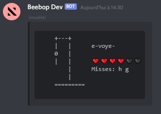

# Discord Hangman

Discord Hangman is a powerful [Node.js](https://nodejs.org) module that allows you to easily create hangman games on discord !

If you have an idea or a problem, don't hesitate to open an issue :)

## Features

-   ⏱️ Easy to use! Create the game and the module takes care of the rest!
-   ⚙️ Two gamemodes : random and custom !
-   💥 Multiplayer support and auto-gathering players !
-   ✋ Filter: Allow only certain players to join a game !
-   🌐 Support for all languages !

## Description

This module provides the ability to create Hangman games on Discord! You can choose between two game modes: random and custom.
- Random: The word is chosen randomly
- Custom: One of the players is randomly drawn to choose the word

Example : A screenshot of the game



## Installation

```js
npm install SimonLeclere/discord-hangman#node-v12
```

## Documentation

To quickly understand how to use the module, you can read [Getting Started](/docs/gettingStarted.md).

## Credits

This module is inspired by this repo :
https://github.com/Zheoni/Hanger-Bot

Which is unfortunately no longer updated :/
